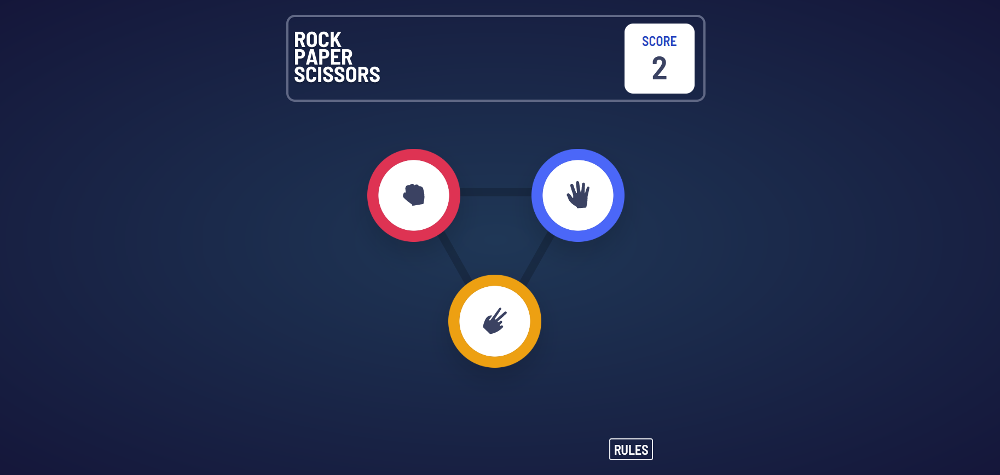

   <br>
     

# Frontend Mentor - Rock, Paper, Scissors solution

This is a solution to the [Rock, Paper, Scissors challenge on Frontend Mentor](https://www.frontendmentor.io/challenges/rock-paper-scissors-game-pTgwgvgH). Frontend Mentor challenges help you improve your coding skills by building realistic projects. 

## Table of contents

- [Overview](#overview)
  - [The challenge](#the-challenge)
  - [Screenshot](#screenshot)
  - [Links](#links)
  - [Known Bugs](#known-bugs)
  - [ToDo](#todo)
- [My process](#my-process)
  - [Built with](#built-with)
  - [What I learned](#what-i-learned)
  - [Continued development](#continued-development)
  - [Useful resources](#useful-resources)
- [Author](#author)

## Overview

### The challenge

Users should be able to:

- View the optimal layout for the game depending on their device's screen size
- Play Rock, Paper, Scissors against the computer
- Maintain the state of the score after refreshing the browser _(optional)_
- **Bonus**: Play Rock, Paper, Scissors, Lizard, Spock against the computer _(optional)_

### Screenshot




### Links

- Solution URL: [Solution](https://github.com/NorskViking/rock-paper-scissors-master)
- Live Site URL: [Try the game](https://norskviking.github.io/rock-paper-scissors-master/)

### Known bugs

- When deploying the game on gh-pages, only blank screen is displayed.
- On computer win, shadow-rings is placed over player-choice display, even though player-choice should have z-index 70 and computer-choice z-index 0
- In 'Rock, Paper, Scissor, Lizard, Spock' gamemode, the 'rock'-button have missing pointer area in the middle, making the player have to click the outer edges to choose 'rock', unknown why this is.

### ToDo

- [ ] Deploy to Github-pages via my portfolio website
- [x] Implement a Rock, Paper, Scissor, Spock & Lizard version
- [x] Implement function for changing between RPS & RPSSL
- [x] Add home to portfolio button
- [ ] Optimize Components for use in the different game-modes

## My process

### Built with

- Mobile-first workflow
- [React](https://reactjs.org/) - JS library
- [Typescript](https://www.typescriptlang.org/) - React framework
- [TailwindCSS](https://tailwindcss.com/) - For styles
- Github Actions - for continuos deployment

### What I learned

- During this project I've been able to deepen my knowledge of Typescript, and learned how to use TailwindCSS for styling my components. <br>

- Using useState for handling changes and rendering components.

A small function in my GameMode button, that renders the game chosen by the player ([GameMode.tsx](./src/components/GameMode.tsx))
```ts
{isChecked === false ? (
  <RPS_GAME />
) : (
  <RPSLS_GAME />
)}
```

### Continued development

In the future I plan on keep deepening my knowledge in Typescript and Tailwind, and the Javascript framework in general. I have some fullstack PERN projects in mind, where I will make use of freely available RestAPI's. 

### Useful resources

- [tailwindcss.org](https://tailwindcss.com/) - The documentation is well written and easy to understand, which made it easy for me to learn how to use it for styling.
- [geeksforgeeks.org](https://www.geeksforgeeks.org) - They have many well written guides and articles, that helped me when I got stuck in places. One of their articles helped me solve a problem I had with z-index not seemingly working as intended.


## Author

- Website - [Jørgen S. Baumann](https://norskviking.github.io/portfolio/)
- Frontend Mentor - [@NorskViking](https://www.frontendmentor.io/profile/NorskViking)
