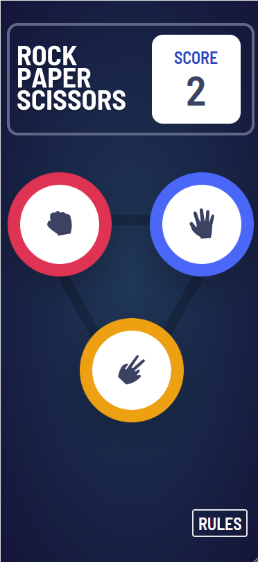

# Frontend Mentor - Rock, Paper, Scissors solution

This is a solution to the [Rock, Paper, Scissors challenge on Frontend Mentor](https://www.frontendmentor.io/challenges/rock-paper-scissors-game-pTgwgvgH). Frontend Mentor challenges help you improve your coding skills by building realistic projects. 

## Table of contents

- [Overview](#overview)
  - [The challenge](#the-challenge)
  - [Screenshot](#screenshot)
  - [Links](#links)
  - [ToDo](#todo)
- [My process](#my-process)
  - [Built with](#built-with)
  - [What I learned](#what-i-learned)
  - [Continued development](#continued-development)
  - [Useful resources](#useful-resources)
- [Author](#author)

## Overview

### The challenge

Users should be able to:

- View the optimal layout for the game depending on their device's screen size
- Play Rock, Paper, Scissors against the computer
- Maintain the state of the score after refreshing the browser _(optional)_
- **Bonus**: Play Rock, Paper, Scissors, Lizard, Spock against the computer _(optional)_

### Screenshot

### Links

- Solution URL: [Solution](https://github.com/NorskViking/rock-paper-scissors-master)
- Live Site URL: [Try the game](https://norskviking.github.io/portfolio/RPS)

### ToDo

- [ ] Deploy to Github-pages via my portfolio website
- [ ] Implement a Rock, Paper, Scissor, Spock & Lizard version
- [ ] Implement function for changing between RPS & RPSSL
- [x] Add home to portfolio button
- [ ] Optimize Components for use in the different game-modes

## My process

### Built with

- Semantic HTML5 markup
- CSS custom properties
- Mobile-first workflow
- [React](https://reactjs.org/) - JS library
- [Typescript](https://www.typescriptlang.org/) - React framework
- [TailwindCSS](https://tailwindcss.com/) - For styles

### What I learned

During this project I've been able to deepen my knowledge of Typescript, and learned how to use TailwindCSS for styling my components. 

### Continued development

In the future I plan on keep deepening my knowledge in Typescript and Tailwind, and the Javascript framework in general. I have some fullstack PERN projects in mind, where I will make use of freely available RestAPI's. 

### Useful resources

- [tailwindcss.org](https://tailwindcss.com/) - The documentation is well written and easy to understand, which made it easy for me to learn how to use it for styling.
- [geeksforgeeks.org](https://www.geeksforgeeks.org) - They have many well written guides and articles, that help me when I got stuck in places. One of their articles helped me solve a problem I had with z-index not seemingly working as intended.

## Author

- Website - [Jørgen S. Baumann](https://norskviking.github.io/portfolio/)
- Frontend Mentor - [@NorskViking](https://www.frontendmentor.io/profile/NorskViking)
